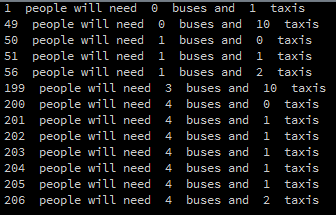

Buses and Taxis
===============
This assignment is similar to the previous temperature conversion and Computus assignments. Your program will have a list of numbers. The numbers in the list are the number of people who need to be transported. They will be transported on buses and taxis according to these rules:
+ Buses must be loaded up first, and each bus must carry exactly 50 people.
+ Any remaining people should ride in taxis. A taxi can hold anywhere up to 5 people.
Your program will calculate the minimum number of buses and taxis that would be needed to carry various numbers of people.

Suggusted Steps to complete this assignment:
 
1. Start a new Python program in Processing. 
2. Create a list with the following numbers: 1,49,50,51,56,199,200,201,202,203,204,205,206
3. Write a for each loop that traverses the list and prints each number
4. Now add three variables to the loop that store the number of buses, the number of people left over who need taxis and the number of taxis: `buses`, `taxiPeople` and `taxis`
5. Write some expressions to do the calculations for `buses`, `taxiPeople` and `taxis`. You will only need to use addition, integer division and modulus.
Your output should look something like this:   

Note: It is possible to write this program using only what we have learned in Python so far. It is not necessary to use `ceil` or `if`, whatever those are.
